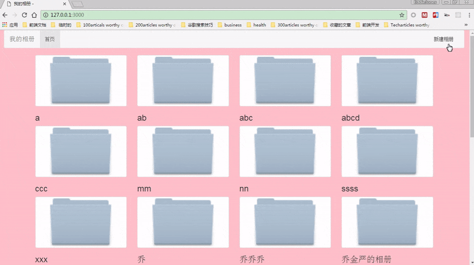

# album-express
express搭建的简单相册，功能有查看相册内图片，新建相册文件夹，上传图片

### 开始(先装node，版本6.0+)
- 项目文件夹`album-express`下打开命令行，输入`npm install` 安装依赖项
- 项目文件夹`album-express`下打开命令行，输入`node app.js`运行程序
- 浏览器打开`http://127.0.0.1:3000/` 查看效果

### 项目用到的技术
- bootstrap搭建前端页面
- node写后台程序
- express框架搭建http服务
- ejs模板引擎渲染后台模板文件
- 处理图片上传提交用了formidable中间件

### 效果

- 新建相册    
    
- 查看相册内容  
    
- 上传图片  
    

#### 流程解析
* app.js文件，node入口文件，
    实例express，app.use,express.static配置静态资源
    app.set配置模板引擎，后端模板引擎用的是ejs
    app.listen 设置服务器地址端口，开启服务器
* router.js文件，设置路由
    express.Router()获取路由对象
    router.get设置路由
* handlers.js文件，编写具体的路由处理函数
    fs.readdir读取文件夹内容
    res.render渲染模板文件，并且将渲染好的html字符串发送给浏览器
    req.query得到查询字符串的值
    JSON.stringify(obj)将json对象转换成json字符串
    res.writeHead()写响应头
    res.end()
    res.redirect()网页重定位
* config.js文件，配置文件
    配置host、port、以及允许访问的静态文件夹地址（用绝对路径）


### 代码解析
#### 首页相册列表展示

1. `router.js`文件，设置路由`router.get('/',handler.showIndex)`
2. 取得文件夹数组，render方法渲染静态模板,并发送给浏览器
    ```js
        /**
         * handler.js文件
         * GET /
         */
        exports.showIndex = (req, res) => {
            fs.readdir(config.uploadDir, (err, files) => {
                if (err) {
                    throw err
                }

                let albums = []

                files.forEach(item => {
                    const currentPath = path.join(config.uploadDir, item)
                    if (fs.statSync(currentPath).isDirectory()) {
                        albums.push(item)
                    }
                })
                // console.log(albums)
                //渲染页面,模板文件为index.ejs
                res.render('index', {
                    albumNames: albums
                })
            })
        }

        // index.ejs文件中重点代码
        <div class="container">
          <div class="row">
              <% albumNames.forEach(function(albumName){%>
                  <div class="col-xs-6 col-md-3">
                    
                    <a href="/album?albumName=<%= albumName %>" class="thumbnail">
                      
                    </a>
                    <div class="caption">
                      <h3><%= albumName %></h3>
                    </div>
                  </div>
              <% }) %>
          </div>
        </div>
    ```

    
#### 新建相册
1. req.query拿到查询字符串的值
2. 判断是否为空
3. fs.readdir取得服务器端文件夹内的内容，判断新建的文件夹名字是否与服务器端的文件夹重名
4. fs.mkdir新建文件夹
5. res.redirect('/')跳转到首页
```html
    /**
     * handler.js文件中相应代码
     * GET /add?albumName=xxx
     */
    //拿到请求字符串，为空，响应'相册名称不能为空'。遍历服务端本地文件夹，
    //如果要新建文件夹名称，服务端已经有了相同名字的文件夹，
    //响应'该相册名称已存在'，否则，fs.mkdir新建文件夹，成功后跳转到首页
    <!-- handler.js -->
    exports.doAdd = (req, res) => {
        const albumName = req.query.albumName
        if (albumName.trim() === '') {
            return res.end('相册名称不能为空')
        }
        let albums = []
            // const albumPath = path.join(config.uploadDir,albumName)
        fs.readdir(config.uploadDir, (err, files) => {
            if (err) {
                throw err
            }
            // console.log(files) // ['a',...]
            files.forEach((item) => {
                const albumPath = path.join(config.uploadDir, item)
                // console.log(albumPath)
                // console.log(fs.statSync(albumPath))  //一个对象
                // console.log(fs.statSync(albumPath).isDirectory())//true
                if (fs.statSync(albumPath).isDirectory()) {
                    albums.push(albumPath) 
                }
            })

            const dest = path.join(config.uploadDir,albumName)
            // console.log([12,2,3].some(a => {return a === 3})) // true
            // fs.readdir 是异步的，这段代码只能写在这里
            if (albums.some(album => { return album === dest })) {
                return res.end('该相册名称已存在')
            }
            fs.mkdir(path.join(config.uploadDir, albumName), err => {
                if(err){
                    throw err
                }
                //重新定位到首页
                res.redirect('/')
            })
        })

        // fs.readdir 是异步的，这段代码不能写在这里
        // if (albums.some(album => { return album === dest })) {
        //     return res.end('该相册名称已存在')
        // }
        // fs.mkdir(path.join(config.uploadDir, albumName), err => {
        //     if(err){
        //         throw err
        //     }
        //     //重新定位到首页
        //     res.redirect('/')
        // })
    }
    

    <!-- index.ejs文件中的代码 -->
    <!-- action: The URI of a program that processes the form information.  -->
    <form action="/add" method="get">
          <input type="text" class="form-control" name="albumName" placeholder="请输入相册名称">
        <button type="submit" class="btn btn-success">点击添加</button>
    </form>
```
#### 相册页面图片展示
1. req.query取得查询字符串的值
2. path.join转成绝对路径
3. fs.readdir()读取文件夹内容，得到由文件夹名称组成的一个数组
4. res.render()渲染模板文件
```js
    /**
     + GET /album?albumName=xxx
     */
    exports.showAlbum = (req, res) => {
        const albumName = req.query.albumName
        const albumPath = path.join(config.uploadDir, albumName)

        fs.readdir(albumPath, (err, files) => {
            if (err) {
                throw err
            }
            // console.log(files)
            // 字符串拼接用到了ES6语法
            // 箭头函数写在一行不加`{}`,会默认返回表达式的结果，不用写`return`了
            files = files.map(fileName => fileName = `${albumName}/${fileName}`)
            // 上面这句代码也可以这么写
            // files = files.map(file=>{ 
            //    return file = `${albumName}/${file}`
            // })
            // console.log(files)
            //渲染页面，并且将渲染好的html字符串发送给客户端
            res.render('album', {
                imgPaths: files,
                albumName: albumName
            })
        })
    }

    <!-- index.ejs文件相关代码 -->
    <a href="/album?albumName=<%= albumName %>" class="thumbnail">
```
    
#### 上传图片到指定相册
1. 解析取得查询字符串，req.query
2. formidable中间件，处理复杂表单提交
3. res.redirect()重定向，注意用encodeURI进行URI编码
```js
    // handler.js文件中的代码
    /**
     * POST /album?albumName=xxx
     */
    exports.upload = (req,res)=>{
        const albumName = req.query.albumName

        const form = new formidable.IncomingForm()
        // console.log(path.join(config.uploadDir,albumName))
        form.uploadDir = path.join(config.uploadDir,albumName)
        form.keepExtensions = true
        form.maxFieldsSize = 5 * 1024 * 1024

        form.parse(req,(err,fields,files) =>{
            if(err){
                throw err
            }
            // 浏览器在和服务器进行通信的时候是不能在url中包含汉字的，
            // 可能我们在浏览器地址栏能看见汉字，但是浏览器在发送请求url的时候，已经默认将url进行转码了。
            // 乔
            // console.log(albumName)
            // %E4%B9%94
            // console.log(encodeURI(albumName))
            res.redirect(`/album?albumName=${encodeURI(albumName)}`)
        })
    }

    <!-- album.ejs -->
    <!-- 
      有文件的表单提交：
        1. method="post" 必须
        2. 将表单的 enctype="multipart/form-data"
        3. file类型的input也必须有 name 属性
     -->
    <form action="/album?albumName=<%= albumName %>" method="post" enctype="multipart/form-data">
          <input type="file" name="image" class="form-control" multiple="multiple">
        <button type="submit" class="btn btn-success">点击上传</button>
    </form>
```

#### 表单注意事项
-  有文件的表单提交 method 必须是 post
-  必须显式的将表单的 envtype 属性设置为 multipart/form‐data
-  同样的，file 类型的 input 元素也必须有 name 属性
- 处理复杂表单提交用formidable中间件


#### 问题
- node 什么情况下要写响应头`res.writeHead()`?  
    默认情况下，使用`res.writeHead`方法写入响应头后，允许使用`res.write`方法写入任意长度的响应体数据，并使用`res.end`方法结束一个响应。

### 其他
#### 查询node API 建议使用[devdocs](http://devdocs.io)
#### 起本地服务
修改`config.host`为本地ip地址后，就算在本地起服务了，相当于我的电脑是一个服务器，可以接收浏览器的请求，并返回响应数据，这在写代码，需要写post请求的时候，挺有用的。

步骤：

1. 更改config.js文件
```
// config.js文件
module.exports = {
    port: 3000,
    host: '192.168.50.211', // 本地ip，命令行敲ipconfig查看
    //这是绝对路径
    uploadDir: path.join(__dirname,'uploads'),
    viewPath: path.join(__dirname,'views'),
    //这个也没有用上
    viewExt: '.html'
}
```

2. router.js文件配置路由
```
router
    .post('/hehe',handler.hehe)
```

3. handler.js文件写处理函数
```
// 类似这样的
exports.hehe = (req,res)=>{
    const data = {hey: 1}
    res.json(data)
}
```

#### MIT 代码是别人的，我跟着写了遍 


   

    
    


